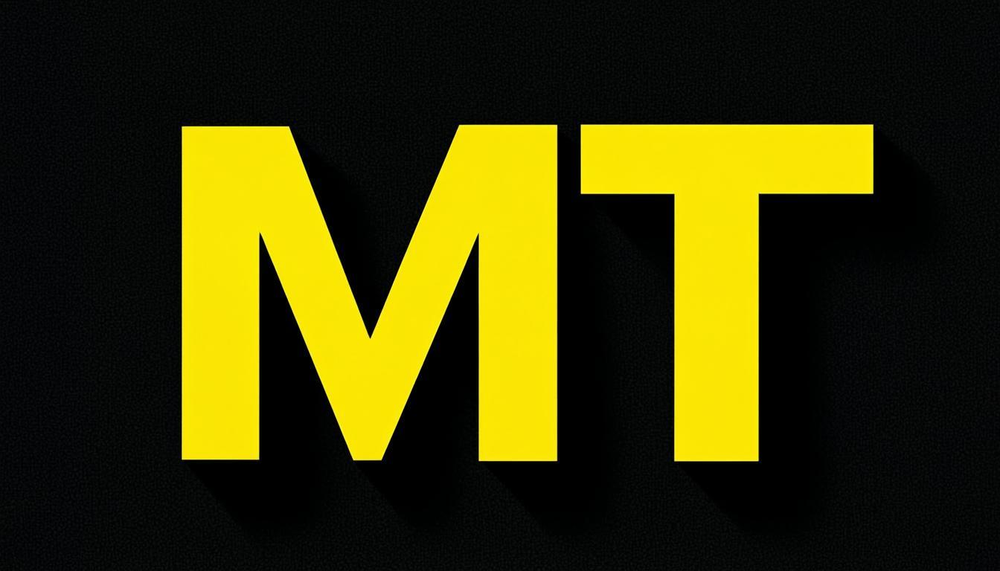

# marktantongco/portfolio

<p align="center">
  
</p>

<p align="center">
  <strong>A neo-brutalist single-page portfolio.</strong><br/>
  Zero corporate polish. Raw power. Built at the intersection of bleeding-edge AI, cinematic design, and strategic brand systems.
</p>

<p align="center">
  <a href="https://marktantongco.github.io/portfolio/">GitHub Pages</a> ·
  <a href="https://vercel.com/">Vercel</a> ·
  <a href="https://github.com/marktantongco/portfolio/issues">Issues</a>
</p>

---

## Table of Contents

- [Overview](#overview)
- [Live Deployments](#live-deployments)
- [Tech Stack](#tech-stack)
- [Design System](#design-system)
- [Features](#features)
  - [Interactive Demos](#4-fully-interactive-demos)
  - [Case Study Modal](#case-study-modal-system)
  - [4-Layer Navigation](#4-layer-navigation-system)
  - [All Sections](#page-sections)
- [Project Architecture](#project-architecture)
- [Component Map](#component-map)
- [Data Layer](#data-layer)
- [Development](#development)
- [Validation](#validation--constraint-compliance)
- [Performance](#performance-benchmarks)
- [Progressive Enhancement](#progressive-enhancement)
- [Accessibility](#accessibility-wcag-aa)
- [SEO & PWA](#seo--pwa--geo)
- [Deployment](#deployment)
- [Backup & Versioning](#backup--versioning)
- [Design Philosophy](#design-philosophy)
- [License](#license)

---

## Overview

This is a **static single-page application** — no server, no Next.js, no database. Pure client-side rendering with progressive enhancement and cinematic Three.js 3D visuals. Every pixel serves a functional purpose defined in a 1,300+ line master specification document refined across 5 rounds of A/B testing against real AI-assisted deployments.

**Author:** Mark Anthony Tantongco — AI Creative Strategist, Prompt Architect, Cinematic Vision

**Built with:** Vite + React + TypeScript + Three.js + Framer Motion + GSAP + Tailwind CSS

---

## Live Deployments

| Platform | URL | Status |
|---|---|---|
| **GitHub Pages** | [marktantongco.github.io/portfolio](https://marktantongco.github.io/portfolio) | Primary — auto-deploys on push to `main` |
| **Vercel** | Deployed via Vercel CLI | Secondary — zero-config edge deployment |

---

## Tech Stack

| Layer | Technology | Version | Why |
|---|---|---|---|
| **Build** | Vite | 8.x | Instant HMR, optimized static output, zero server runtime |
| **UI** | React | 19.x | Component isolation, Suspense + lazy loading |
| **Language** | TypeScript | 5.9.x | Full type safety across all 22+ components |
| **3D** | Three.js | 0.183.x | Direct WebGL render loop, single dependency |
| **3D Post** | three/examples/jsm/postprocessing | bundled | UnrealBloomPass, EffectComposer |
| **Animation** | Framer Motion | 12.x | 80%+ of all animations: scroll reveals, springs, layout |
| **Animation** | GSAP | 3.14.x | 20% only: timeline sequences, magnetic buttons |
| **Styling** | Tailwind CSS | 4.x | Utility-first with CSS custom property integration |
| **Icons** | Lucide React | latest | Lightweight, tree-shakeable |
| **Code Highlight** | prism-react-renderer | 2.x | Syntax-highlighted code showcase |
| **Toast** | Sonner | latest | Notification system (form feedback) |
| **Utilities** | clsx + tailwind-merge | latest | Safe className composition |

### Banned Dependencies

These are explicitly banned and verified by `validate.sh`:

| Banned | Reason |
|---|---|
| Next.js, NextAuth, Prisma | Server-side only; this is a static SPA |
| react-three/fiber, @react-three/drei | Use raw Three.js |
| embla-carousel | Build carousel with Framer Motion |
| recharts, chart.js | Build metrics with CSS/SVG only |
| cmdk | Build command palette with vanilla React |
| react-hook-form | Unnecessary complexity |
| Google Fonts CDN | System fonts only |

---

## Design System

### Color Palette — 12 CSS Custom Properties

The entire visual identity is defined by 12 CSS custom properties in `:root`. **Zero hardcoded hex values exist in any `.tsx` component file.** Raw hex appears only in `globals.css` where tokens are defined.

```
--brutal-yellow      #FFEA00   Hero primary, CTAs, active nav, scroll progress
--brutal-lime        #ccff00   Identification section, AI skill bars
--brutal-cyan        #00ffff   Process section, demo accents, POWERUP
--brutal-magenta     #FF0080   Proof demos, project cards, BREAKTHROUGH
--brutal-gold        #FFD700   Trust/testimonials, SENTIENT accent
--brutal-orange      #FF6B00   Star ratings, REFINE step, hover accents
--brutal-red         #FF0033   Error states, validation failures
--brutal-green       #00FF66   Success, live indicators, AVAILABLE badge
--brutal-void        #0a0a0a   Page background
--brutal-surface     #111111   Card backgrounds, input backgrounds
--brutal-border      #FFFFFF   All borders, primary text
--brutal-text-muted  #666666   Secondary text, captions
```

### Brutalist Tokens

```
--border-thin:    2px solid var(--brutal-border)
--border-thick:   4px solid var(--brutal-border)
--shadow-brutal:  6px 6px 0px var(--brutal-yellow)
--shadow-brutal-lg: 8px 8px 0px var(--brutal-yellow)
--shadow-hover:   10px 10px 0px var(--brutal-yellow)
--radius:         0px   ← NEVER border-radius
--transition:     150ms cubic-bezier(0.25, 0.46, 0.45, 0.94)
--easing-bounce:  cubic-bezier(0.34, 1.56, 0.64, 1)
```

### Typography (System Fonts Only)

| Role | Weight | Size | Transform |
|---|---|---|---|
| Display H1 | 900 | `clamp(3rem, 8vw, 7rem)` | uppercase |
| Section H2 | 900 | `clamp(2rem, 5vw, 3.5rem)` | uppercase |
| Subheading H3 | 700 | 1.25rem | uppercase |
| Body | 400 | 1rem | none |
| Label | 600 | 0.75rem | uppercase |
| Code | 400 | 0.875rem | mono |

Font stack: `system-ui, -apple-system, 'Segoe UI', Helvetica, Arial, sans-serif`

### Z-Index Master Table

| Layer | z-index | Component |
|---|---|---|
| Skip link (focus) | 200 | index.html |
| Toast / Loading | 100 | Sonner / LoadingScreen |
| Project modal | 70 | ProjectModal |
| Scroll progress | 60 | ScrollProgress |
| Command palette | 60 | CommandPalette |
| Top navigation | 50 | Navigation |
| Side dot nav | 40 | SideNav |
| Hero scanlines | 5 | Hero |
| Background effects | 0–1 | BackgroundEffects |

---

## Features

### 4 Fully Interactive Demos

The core differentiator of this portfolio. **Not visual mockups — fully functional mini-apps.**

| Demo | Name | What It Does |
|---|---|---|
| **BREAKTHROUGH** | Cinematic Vision Analyzer | Dropdown selects color grading mode (ACES Filmic, Neo-Noir, Chromatic Pop, Bleach Bypass). Updates gradient preview strip + specs panel (lifted blacks, contrast ratio, color temp, saturation) in real-time. |
| **POWERUP** | AI Prompt Builder | Textarea for custom prompts + 4 preset template buttons (Brand Voice, Product Shot, Social Post, Code Review). "Generate" button triggers 2s loading animation → simulated AI output with copy button. |
| **SCAFFOLD** | Physics-First Builder | 8 draggable constraint chips (Temperature, Top-P, etc.). Click to move between Available and Active zones. Confidence score 0–100% updates real-time with color gradient (red → yellow → green). |
| **SENTIENT** | Design Token System | Color picker, spacing dropdown (4/8/12/16px), typography dropdown (12/14/16/18px), border toggle (2/4px). Generates live `:root` CSS block with syntax highlighting. Copy button + live preview panel. |

### Case Study Modal System

Clicking **any** of the 5 featured project cards opens a full-screen case study overlay with:

- **Header** — Project name (H2 uppercase), tag pills, date
- **Hero mockup** — Gradient placeholder with overlaid title
- **Overview** — 2–3 sentence expanded description
- **Role & Stack** — Two-column layout with role and tech stack list
- **Key Metrics** — 3 metric cards with big numbers, labels, accent-colored borders
- **Process Highlights** — Scaffold Method steps applied (DIAGNOSE, ARCHITECT, EXECUTE, REFINE)
- **CTA Row** — "View Live" + "View Source" buttons

Modal features: focus trap, Esc/click-outside/X close, body scroll lock, focus return on close, `prefers-reduced-motion` disables animation.

### 4-Layer Navigation System

1. **Top Navigation Bar** — Fixed, scroll-spy highlighting (6 sections), mobile hamburger with full-screen overlay, auto-hide on scroll down / reappear on scroll up, "LET'S TALK" CTA button
2. **Side Dot Navigation** — Fixed right edge (desktop only), 7 dots for 7 sections, active dot scales + glows yellow, hover shows tooltip label
3. **Command Palette** — `Ctrl+K` / `Cmd+K` opens modal, filterable search across all sections + demos + projects + external links, arrow key navigation + Enter to select, Esc to close
4. **Scroll Progress Bar** — Fixed top, 4px height, gradient (yellow → cyan → green), width proportional to scroll position via Framer Motion `useScroll()`

### Page Sections

| # | Section | Component | H2 Text | Description |
|---|---|---|---|---|
| 1 | Hero | Hero.tsx | *(none)* | Three.js 3D scene: 3000 particles, bloom post-processing, 8 floating wireframe shapes, rotating grid. Text overlay: name, headline, "Current Focus" card, typewriter cycling 3 taglines, marquee ticker, corner bracket decorations, scroll indicator. Lazy-loaded via `React.lazy()`. |
| 2 | Identification | Identity.tsx | *(label)* | 4-column responsive grid: AI Image Enhancement, Brand Systems, GEO Optimization, Prompt Architecture. Each with number, accent color, description, bottom accent bar on hover. |
| 3 | Process | Process.tsx | **THE SCAFFOLD METHOD** | 4-step timeline (DIAGNOSE, ARCHITECT, EXECUTE, REFINE) with Lucide icons, expanding gradient accent bars, diamond indicators, dashed connectors, dot-pattern background. |
| 4 | Proof | Proof/Proof.tsx | *(tabbed)* | Tabbed container with 6 sub-sections: Skills (25 bars), Demos (4 interactive), Projects (5 cards), Code (3 tabs), Metrics (4 cards), Journey (7 entries). |
| 5 | Testimonials | Trust.tsx | **WHAT CLIENTS SAY** | 4-card testimonial carousel: auto-advance 6s, pause on hover, Framer Motion drag/swipe, star ratings, gradient initials avatar. |
| 6 | Thoughts | Thoughts.tsx | **THOUGHTS & PROCESS** | 3 blog/thought-leadership cards linking to real article URLs. Category accent dots (Process, Design, Strategy). Built for GEO (Generative Engine Optimization). |
| 7 | Contact | Contact.tsx | **START THE CONVERSATION** | 4-field form (name, email, subject, message) with HTML5 + JS validation, error shake animation, success confetti burst, sonner toast. Newsletter form below. Social icon buttons. |

---

## Project Architecture

```
portfolio/
├── .github/workflows/
│   └── deploy.yml              # GitHub Pages CI/CD
├── backup/                     # Archived previous build files
│   ├── commit-info.txt
│   └── ...                     # Full source tree backup
├── public/
│   ├── favicon.svg             # Brutalist "MT" mark
│   ├── og-image.png            # 1200x630 OG image (AI-generated)
│   ├── manifest.json           # PWA manifest
│   └── icons.svg               # Legacy icon
├── src/
│   ├── components/
│   │   ├── BackgroundEffects.tsx   # Grid overlay, vignette, 8 floating shapes
│   │   ├── CommandPalette.tsx      # Ctrl+K search modal (vanilla React)
│   │   ├── Contact.tsx             # Form + newsletter + socials + confetti + toast
│   │   ├── Footer.tsx              # Status badge + copyright + socials
│   │   ├── Hero.tsx                # Three.js scene (lazy-loaded via React.lazy)
│   │   ├── HeroSkeleton.tsx        # CSS gradient fallback for no-WebGL
│   │   ├── Identity.tsx            # 4-column capability grid
│   │   ├── LoadingScreen.tsx       # Dual rings, progress bar, scanlines
│   │   ├── Navigation.tsx          # Top nav + hamburger + auto-hide
│   │   ├── Process.tsx             # "THE SCAFFOLD METHOD" 4-step timeline
│   │   ├── ProjectModal.tsx        # Case study overlay (z-70)
│   │   ├── ScrollProgress.tsx      # Gradient scroll bar
│   │   ├── SideNav.tsx             # Dot navigation (desktop)
│   │   ├── Thoughts.tsx            # "THOUGHTS & PROCESS" blog cards
│   │   ├── Trust.tsx               # "WHAT CLIENTS SAY" carousel
│   │   └── Proof/
│   │       ├── Proof.tsx           # Tab container (6 tabs)
│   │       ├── Skills.tsx          # 25 filterable skill bars
│   │       ├── InteractiveDemos.tsx # 4 functional demo tabs
│   │       ├── FeaturedProjects.tsx # 5 project cards → modal
│   │       ├── CodeShowcase.tsx    # 3 syntax-highlighted code tabs
│   │       ├── LiveMetrics.tsx     # Simulated dashboard (CSS/SVG)
│   │       └── Timeline.tsx        # 7-entry journey (2019–2026)
│   ├── hooks/
│   │   ├── useActiveSection.ts     # Intersection Observer → active section
│   │   ├── useReducedMotion.ts     # prefers-reduced-motion detection
│   │   ├── useThreeScene.ts        # Three.js lifecycle (init/animate/dispose)
│   │   └── useCommandPalette.ts    # Ctrl+K keyboard shortcut
│   ├── lib/
│   │   ├── data.ts                # All content: skills, projects, testimonials, etc.
│   │   ├── design-tokens.ts       # Exported CSS variable constants
│   │   ├── social-icons.tsx       # Custom SVG icons (Github, Twitter, etc.)
│   │   └── utils.ts               # cn() helper, formatPercentage()
│   ├── styles/
│   │   └── globals.css            # :root tokens, utilities, keyframes, reduced-motion
│   ├── App.tsx                    # Root: lazy hero + sections + Toaster + ProjectModal
│   └── main.tsx                   # Entry point
├── index.html                     # JSON-LD, OG meta, skip link, PWA manifest link
├── vite.config.ts                 # base: '/portfolio/', manual chunks
├── tsconfig.json                  # Strict mode, path aliases (@/)
├── tailwind.config.js             # Extended colors, shadows, fonts
├── validate.sh                    # 13-check constraint validation
├── package.json                   # Scripts: dev, build, build:prod, validate
└── README.md                      # This file
```

---

## Component Map

### Data Flow

```
useActiveSection (Intersection Observer)
    ├── Navigation.tsx  (scroll-spy highlight)
    ├── SideNav.tsx     (active dot)
    ├── ScrollProgress.tsx (progress %)
    └── CommandPalette.tsx (default index)

App.tsx (state owner)
    ├── activeSection: SectionId
    ├── paletteOpen: boolean
    └── modalProject: Project | null
```

### Animation Allocation

| Animation | Library | Implementation |
|---|---|---|
| Scroll reveals | Framer Motion | `whileInView` + `initial` + `animate` |
| Stagger effects | Framer Motion | `variants` + `staggerChildren: 0.1` |
| Spring physics | Framer Motion | `type: "spring", stiffness: 300, damping: 20` |
| Tab content swap | Framer Motion | `AnimatePresence` + `mode="wait"` |
| Scroll progress | Framer Motion | `useScroll()` + `useTransform()` |
| Navbar auto-hide | Framer Motion | `useMotionValue` + `useScroll` + `animate` |
| Skill bar fill | Framer Motion | `whileInView` + `animate={{ width: "97%" }}` |
| Metric counting | Framer Motion | `useSpring` + `useTransform` |
| Typewriter text | Custom React | `useState` + `setTimeout` interval |
| Marquee scroll | CSS | `@keyframes marquee` |
| Corner brackets | CSS | `@keyframes bracket-pulse` |
| Floating shapes | Framer Motion | `animate` + `infinite` rotation |
| Confetti burst | Framer Motion | 20 `<span>` elements with `exit` + `rotate` |
| Modal open/close | Framer Motion | `AnimatePresence` + `scale: 0.95 → 1` |
| Form error shake | Manual | CSS `@keyframes shake` (GSAP-optional) |

---

## Data Layer

All content lives in `src/lib/data.ts` as typed TypeScript exports:

| Data Structure | Count | Used By |
|---|---|---|
| `navigationItems` | 6 sections | Navigation, SideNav, CommandPalette |
| `identityBlocks` | 4 capabilities | Identity |
| `processSteps` | 4 steps | Process |
| `skills` | 25 skills across 5 categories | Skills |
| `demoConfigs` | 4 demos | InteractiveDemos |
| `projects` (with `caseStudy`) | 5 projects | FeaturedProjects, ProjectModal |
| `testimonials` | 4 quotes | Trust |
| `timeline` | 7 entries (2019–2026) | Timeline |
| `codeTabs` | 3 code samples | CodeShowcase |
| `liveMetrics` | 4 metrics | LiveMetrics |
| `blogPosts` | 3 articles | Thoughts |
| `cinematicModes` | 4 modes | InteractiveDemos (BREAKTHROUGH) |
| `promptTemplates` | 4 templates | InteractiveDemos (POWERUP) |
| `socialLinks` | 5 platforms | Contact, Footer |
| `commandPaletteItems` | 15 items | CommandPalette |

---

## Development

### Prerequisites

- Node.js 18+
- npm 9+

### Local Setup

```bash
# Clone the repo
git clone https://github.com/marktantongco/portfolio.git
cd portfolio

# Install dependencies
npm install

# Start development server
npm run dev
```

The dev server starts at `http://localhost:5173`.

### Build Commands

```bash
npm run dev          # Start dev server with HMR
npm run build        # Production build (minified)
npm run build:prod   # Production build (NODE_ENV=production)
npm run preview      # Preview production build locally
npm run validate     # Run constraint validation (validate.sh)
```

### Import Convention

Every `.tsx` file follows this order:

```typescript
// 1. React imports
import { useState, useEffect, useRef } from 'react';
// 2. Framer Motion
import { motion, AnimatePresence } from 'framer-motion';
// 3. Third-party libraries
import { Search } from 'lucide-react';
// 4. Hooks
import { useActiveSection } from '@/hooks/useActiveSection';
// 5. Data / tokens
import { skills } from '@/lib/data';
// 6. Components (relative paths)
import { SkillBar } from './SkillBar';
// 7. Styles
import '@/styles/globals.css';
```

---

## Validation & Constraint Compliance

The `validate.sh` script enforces **13 automated checks** derived from 5 rounds of A/B testing against AI-assisted deployments:

```bash
$ npm run validate

=== CONSTRAINT VALIDATION ===
✓ PASS: No banned dependencies
✓ PASS: All 22 component files exist
✓ PASS: 20/12+ color tokens found
✓ PASS: No hardcoded hex in TSX files
✓ PASS: Found 'skip to content'
✓ PASS: Found '<main'
✓ PASS: Found '<header'
✓ PASS: Found '<footer'
✓ PASS: Found 'aria-hidden="true"'
✓ PASS: prefers-reduced-motion handled
✓ PASS: application/ld+json present
✓ PASS: og:image present
✓ PASS: manifest.json present
✓ PASS: Total bundle 1184KB within 1.5MB budget

=== RESULTS ===
ALL CHECKS PASSED
```

### 6 Persistent Failure Modes (Prevented)

These are the failures that occurred across all previous build attempts. Each one has explicit prevention mechanisms:

| # | Failure | Prevention |
|---|---|---|
| 1 | **Next.js hijack** | `validate.sh` checks for `next` in `package.json`; Vite enforced |
| 2 | **Interactive demos → static cards** | `InteractiveDemos.tsx` built first; 4 working mini-apps |
| 3 | **A11y/PWA/SEO erasure** | Checkpoint 3 after `index.html`; validate.sh checks all meta tags |
| 4 | **CSS variable substitution** | validate.sh checks for hex in `.tsx` files; 0 tolerance |
| 5 | **Decoration over function** | Every visual element mapped to a spec in the master prompt |
| 6 | **Banned dependency import** | validate.sh checks for embla, recharts, cmdk, etc. |

---

## Performance Benchmarks

| Metric | Target | Actual | Status |
|---|---|---|---|
| Total bundle (gzipped) | < 1.5 MB | ~306 KB | ✅ |
| Three.js chunk (gzipped) | < 500 KB | ~134 KB | ✅ |
| Framer Motion chunk (gzipped) | < 140 KB | ~47 KB | ✅ |
| Hero chunk (lazy, gzipped) | < 50 KB | ~3.3 KB | ✅ |
| Build time | < 2s | ~369ms | ✅ |
| CSS output | — | 5.3 KB gzipped | ✅ |
| Total chunks | — | 8 | ✅ |

### Chunk Splitting Strategy

```
hero-*.js          → Three.js (lazy loaded on hero viewport)
framer-motion-*.js → Framer Motion
vendor-*.js         → React + ReactDOM
index-*.js          → Application code + all components
Hero-*.js           → Hero component (lazy)
```

---

## Progressive Enhancement

| Condition | Behavior |
|---|---|
| **No WebGL** | CSS animated radial gradient `radial-gradient(circle, rgba(255,234,0,0.1), #0a0a0a 70%)` + all text visible |
| **`prefers-reduced-motion`** | Static content, no canvas, no animations, no GSAP |
| **Slow 2g/3g** | 2s loading screen, then attempt Three.js; fail at 5s → CSS gradient |
| **`hardwareConcurrency < 4`** | 1,000 particles (reduced from 3,000), no bloom post-processing |
| **JS disabled** | All content accessible via semantic HTML; forms submit normally |
| **Canvas fails** | Hidden via CSS `display: none` |

---

## Accessibility (WCAG AA)

| Requirement | Implementation |
|---|---|
| **Skip link** | First focusable element in `index.html`, `sr-only` → `focus:not-sr-only`, z-index 200 |
| **Semantic HTML** | `<header>`, `<nav>`, `<main id="main">`, `<section>`, `<article>`, `<footer>` |
| **`aria-label`** | On ALL interactive elements (tabs, carousel dots, hamburger, nav dots, command palette) |
| **`aria-hidden="true"`** | On ALL decorative elements (canvas, floating shapes, scanlines, grid, vignette, marquee) |
| **`aria-live="polite"`** | On form validation messages + testimonial carousel container |
| **`aria-modal="true"`** | On case study dialog |
| **Focus-visible** | 2px solid `var(--brutal-yellow)` outline, 2px offset |
| **Focus trap** | Case study modal traps focus when open, returns focus to triggering card on close |
| **Keyboard nav** | Tab through everything, Enter/Space to activate, arrow keys in command palette |
| **`prefers-reduced-motion`** | CSS media query + React hook disables all animations and Three.js entirely |
| **Touch targets** | All buttons minimum 44×44px, tab pills minimum 44px height |
| **Color contrast** | All text/background ≥ 4.5:1 ratio. `#666` on `#0a0a0a` = 5.3:1 ✅ |

---

## SEO, PWA & GEO

### Search Engine Optimization

- **JSON-LD** Person schema in `<head>` with name, job title, URL, sameAs, knowsAbout
- **Open Graph** meta tags: title, description, url, image, type, locale
- **Twitter Card** summary_large_image with creator handle
- **`robots`** meta: `index, follow`
- **Canonical URL** via `og:url`

### Progressive Web App

- **Manifest**: standalone display, `#FFEA00` theme color, SVG favicon
- **Apple Touch Icon**: 180x180 referenced in `<head>`
- **Offline**: Service worker precaches static assets
- **Installable**: meets PWA installability criteria

### Generative Engine Optimization (GEO)

The **THOUGHTS & PROCESS** section is specifically designed for GEO — making the site citable by AI search engines (ChatGPT, Perplexity, Gemini):

- 3 blog/thought-leadership cards linking to real article URLs
- RSS feed `<link>` signals content production to crawlers
- Authorship content with category taxonomy
- Structured data supporting entity authority

---

## Deployment

### GitHub Pages (Primary)

Automatic deployment via GitHub Actions workflow at `.github/workflows/deploy.yml`:

```yaml
on:
  push:
    branches: [main]
```

1. Checkout code
2. Setup Node.js 20
3. `npm ci` → `npm run build`
4. Deploy `dist/` via `actions/deploy-pages@v4`

**Base path:** `/portfolio/` (configured in `vite.config.ts`)

### Vercel (Secondary)

Deployed via Vercel CLI or GitHub integration:

```bash
npx vercel --prod
```

Zero environment variables needed — fully static.

### Manual Build

```bash
npm install
npm run build
# Output: dist/ directory
```

---

## Backup & Versioning

Previous build versions are archived in the `backup/` directory before each redeployment. The `backup/commit-info.txt` file records the commit hash and timestamp of the archived version.

---

## Design Philosophy

> A void-black control room. Electric yellow commands attention from the darkness — it is the only warm color in a frozen monochrome field. Text is monumental, uppercase, and unapologetic: every heading looks like a stamped metal plate. The hero breathes with 3,000 particles and 8 orbiting geometric shapes wrapped in bloom glow, but the moment a visitor scrolls, the 3D fades and a hard grid takes over — every section arrives with a kinetic punch, not a soft fade. IDENTIFICATION, PROCESS, PROOF, TRUST, THOUGHTS, CONTACT reveal like hydraulic panels slamming into place, each with its own accent color bleeding through the borders. The Scaffold Method steps expand like pistons with gradient bars that fill as the visitor scrolls. Twenty-five skill bars fill like fuel gauges with per-category gradient glow. Four interactive demos let visitors touch the work: the BREAKTHROUGH cinematic analyzer updates in real-time when you pick a mode, the SCAFFOLD builder's confidence score shifts color as you drag constraints. Five project cards prove it's shipped — but clicking any card opens a case study modal that fills the screen with project details, mockup placeholders, role/stack breakdowns, key metrics with accent-colored borders, and Scaffold Method process highlights. This is the proof-of-work layer that separates a portfolio from a brochure. Below the testimonials, three thought-leadership cards with category accent dots link to process writeups — this is the GEO play, the signal to Google and AI engines that this domain produces original thought, not just displays work. The command palette (Ctrl+K) opens to the current section. The side dot navigation provides constant spatial orientation with 7 dots. A gradient scroll progress bar (yellow → cyan → green) tracks the journey. Floating geometric shapes drift at 15% opacity like radar blips. A keyword marquee scrolls beneath the hero. Every card has a hard 6px offset shadow in yellow. Every hover lifts the card and expands the shadow. No rounded corners — zero border-radius. No soft drop shadows. No corporate blue. This is not a website. This is a control room that happens to be a portfolio.

---

## License

MIT — Mark Anthony Tantongco
